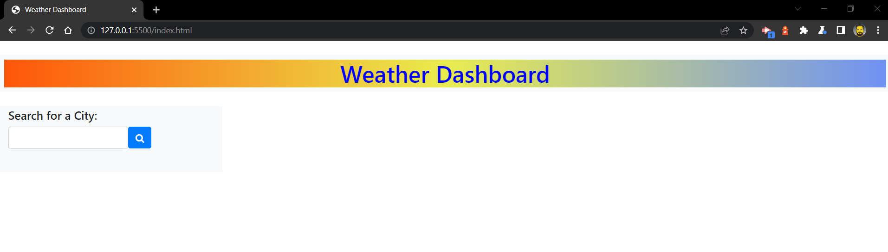
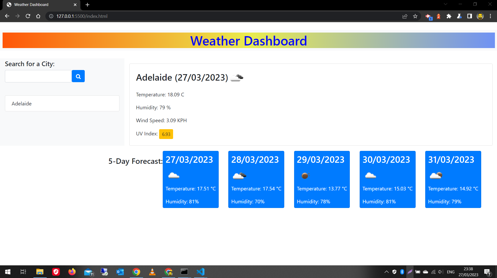
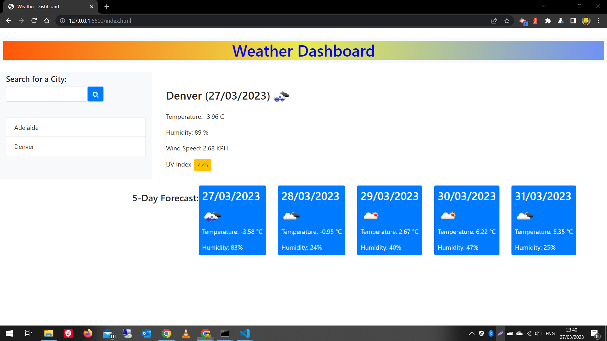
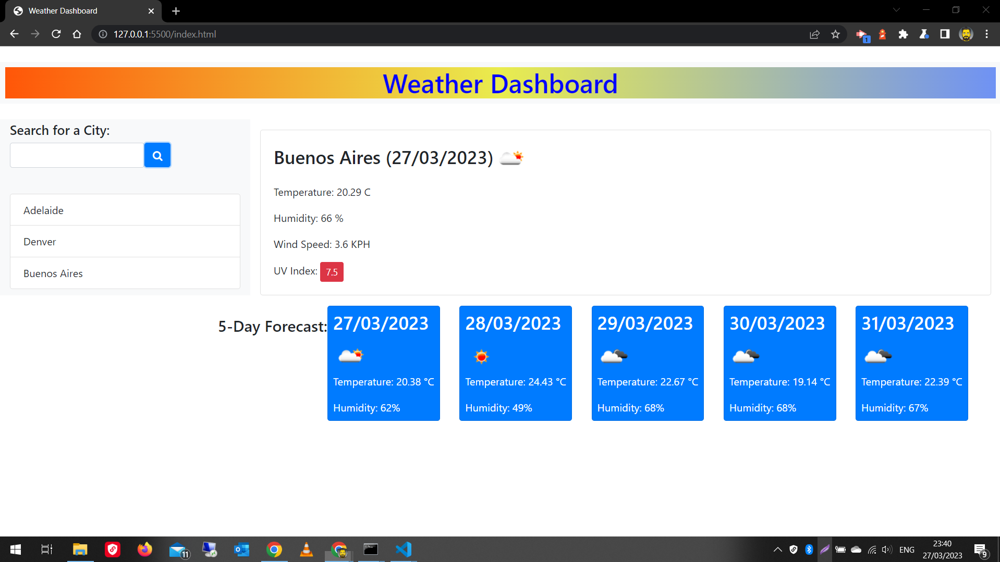
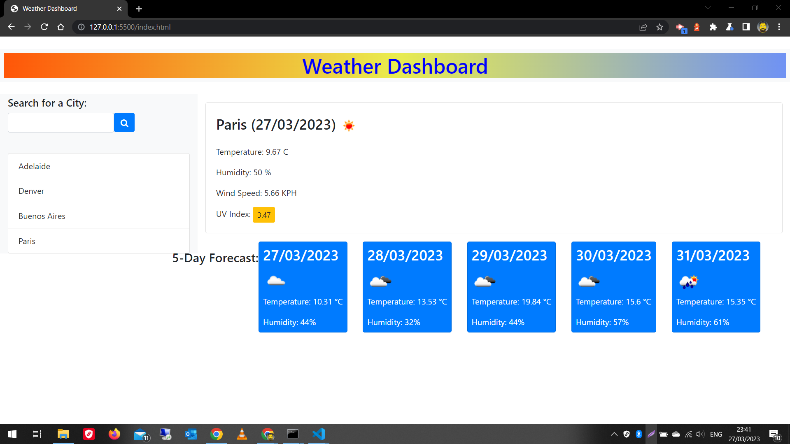

# 06 Server-Side APIs: Weather Dashboard

## Table of contents
* [Task](#task)
* [User Story](#user-story)
* [Acceptance Criteria](#acceptance-criteria)
* [Technologies used](#technologies-used)
* [Live URL](#live-url) 
* [Screenshots](#screenshots)
* [Installation](#installation) 
* [License](#license)

## Task

Third-party APIs allow developers to access their data and functionality by making requests with specific parameters to a URL. Developers are often tasked with retrieving data from another application's API and using it in the context of their own. Your challenge is to build a weather dashboard that will run in the browser and feature dynamically updated HTML and CSS.


## User Story

```
AS A traveler
I WANT to see the weather outlook for multiple cities
SO THAT I can plan a trip accordingly
```

## Acceptance Criteria

```
GIVEN a weather dashboard with form inputs
WHEN I search for a city
THEN I am presented with current and future conditions for that city and that city is added to the search history
WHEN I view current weather conditions for that city
THEN I am presented with the city name, the date, an icon representation of weather conditions, the temperature, the humidity, the wind speed, and the UV index
WHEN I view the UV index
THEN I am presented with a color that indicates whether the conditions are favorable, moderate, or severe
WHEN I view future weather conditions for that city
THEN I am presented with a 5-day forecast that displays the date, an icon representation of weather conditions, the temperature, the wind speed, and the humidity
WHEN I click on a city in the search history
THEN I am again presented with current and future conditions for that city
```
<br>

## Technologies Used 
```
The following technologies are used in this solution:
1. HTML
2. JavaScript 
3. Foundation CSS Framework 
4. jQuery 
5. Moment.js
6. Openweather APIs
7. Google Place APIs
```
<br>


## Live URL 

<br>


## Screenshots


<br>


<br>


<br>


<br>


<br>

## Installation 

No Installation Required. 

<br>

## License 

Not Applicable